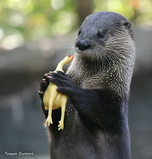

# О себе 🦋

Привет! Я **Вероника Кирильцева**, родом из Красноярского края. Работаю ивент-менеджером в международном бизнес-сообществе, учусь в ИТМО и люблю объединять людей вокруг общих идей.

## Образование

| Этап | Образование |
| --- | --- |
| Окончила | Международный банковский институт имени Анатолия Собчака |
| Учусь сейчас | Университет ИТМО, направление «Управление высокотехнологическим бизнесом» |
| Учебная практика | Курс «Введение в веб технологии», группа U4225 |

## Работа и проекты

Организую мероприятия для членов международного бизнес-сообщества, в том числе **хакатоны по всему миру**. На хакатонах выступаю ментором и координирую участников: помогаю им ориентироваться в процессе и двигаться по программе.

Мне интересно делать рабочие процессы удобнее. Я разработала для себя **CRM-систему в административной панели сообщества** и оптимизировала часть своих задач.

[Подробнее о проектах :material-arrow-right:](projects.md)

## За пределами работы

- 📚 Люблю читать и состою сразу в **двух книжных клубах** — обсуждать книги для меня не менее интересно, чем читать их.
- 💃 Занимаюсь танцами: это моя возможность переключиться и побыть в движении.
- 🏋️ Хожу в зал и нахожу время для тренировок.

## Немного нежности 🦋

<figure markdown>

{ loading=lazy width=320 height=320 }

<figcaption>Для хорошего настроения</figcaption>
</figure>

<figure markdown>

{ loading=lazy width=240 height=320 }

<figcaption>С любовью к маленьким радостям</figcaption>
</figure>

<figure markdown>

{ loading=lazy width=307 height=320 }

<figcaption>И немного несерьёзности</figcaption>
</figure>

