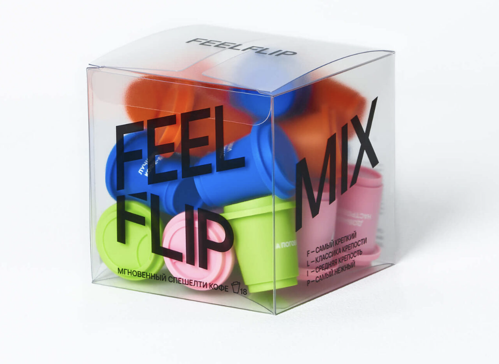
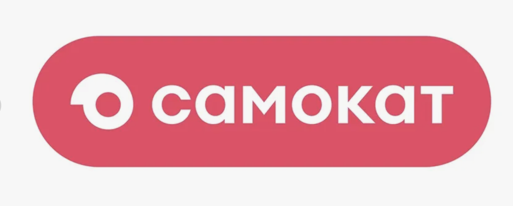
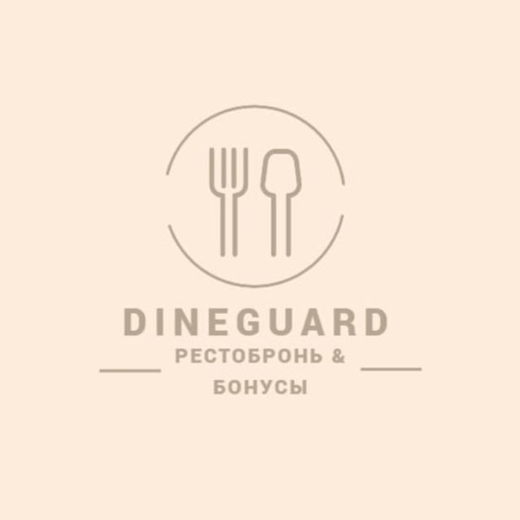

# Проекты 🚀

## Рабочие проекты 🦋

<div class="grid cards" markdown>

-   :material-calendar-heart: **Ивенты и хакатоны по всему миру**

    ---

    Организую мероприятия для членов международного бизнес-сообщества. В рамках хакатонов выступаю ментором и координирую участников.

    **Моя роль:** ивент-менеджер, ментор и координатор.

-   :material-view-dashboard: **CRM для собственных рабочих задач**

    ---

    Разработала CRM-систему в административной панели сообщества и оптимизировала часть своих рабочих процессов.

    **Формат:** внутренний инструмент сообщества.

</div>

## Учебные проекты 🚀

Маркетинг, социальные инициативы и собственный продукт — проекты, над которыми я работаю в рамках обучения.

<div class="grid cards project-showcase" markdown>

-   { .project-image loading=lazy width=1044 height=764 }

    **☕ FeelFlip — маркетинговая стратегия**

    ---

    Работа над маркетинговой стратегией для кофе FeelFlip.

    **Направление:** маркетинг и продвижение бренда.

-   { .project-image loading=lazy width=1636 height=658 }

    **💗 «Самокат» — социальный проект**

    ---

    Разработка социального проекта для продуктового ритейлера «Самокат».

    **Направление:** социальные инициативы в ритейле.

-   { .project-image loading=lazy width=640 height=640 }

    **🍽️ DineGuard — бронирование столов**

    ---

    Работаю над собственным проектом DineGuard для бронирования столов в ресторанах.

    **Направление:** ресторанные сервисы и развитие собственного продукта.

</div>

### Практика по веб-технологиям 💻

Проекты по курсу «Введение в веб технологии»: технологии, выполненные задачи и результаты.

<div class="grid cards" markdown>

-   :material-source-branch: **01 / Репозиторий и рабочее окружение**

    ---

    Подготовка Git-репозитория, README и правил участия. Работа с веткой разработки, Pull Request и слиянием изменений.

    **Технологии:** Git · GitHub · SSH · Markdown

    **Результат:** создан репозиторий, оформлена документация, изменения объединены через Pull Request.

    [Открыть репозиторий :material-arrow-top-right:](https://github.com/89620761583veronika-png/devops-lab-kiriltseva)

-   :material-docker: **02 / Flask в Docker и CI/CD**

    ---

    Контейнеризация небольшого веб-приложения и подготовка автоматической сборки с проверкой HTTP-ответа в GitHub Actions.

    **Технологии:** Python · Flask · Docker · GitHub Actions

    **Результат:** сборка и функциональные проверки выполнены локально и в CI. Публикация в Docker Hub ожидает настройки секретов; сквозной деплой ещё не подтверждён.

    [Открыть репозиторий :material-arrow-top-right:](https://github.com/89620761583veronika-png/lab2-cicd-kiriltseva)

-   :material-chart-line: **03 / Мониторинг учебной среды**

    ---

    Локальный стенд из Prometheus, Node Exporter, Grafana и Nginx. Настройка дашборда и изучение безопасности конфигурации учебного веб-сервера.

    **Технологии:** Docker Compose · Prometheus · Grafana · Nginx

    **Результат:** настроен сбор метрик Linux-среды Docker и визуализация CPU, памяти и диска. Эти показатели не являются прямыми метриками macOS.

    Материалы сохранены локально; публичная версия этой работы пока не размещена.

</div>

## Этот сайт — ещё один практический результат ✨

Портфолио написано на **Markdown** и собирается с помощью **MkDocs Material**. Навигация, поиск, переключатель темы и оформление задаются в конфигурации и таблице стилей.

```yaml
nav:
  - Главная: index.md
  - О себе: about.md
  - Проекты: projects.md
  - Резюме: resume.md
  - Достижения: achievements.md
  - Контакты: contacts.md
```

[Посмотреть учебные результаты](achievements.md)
