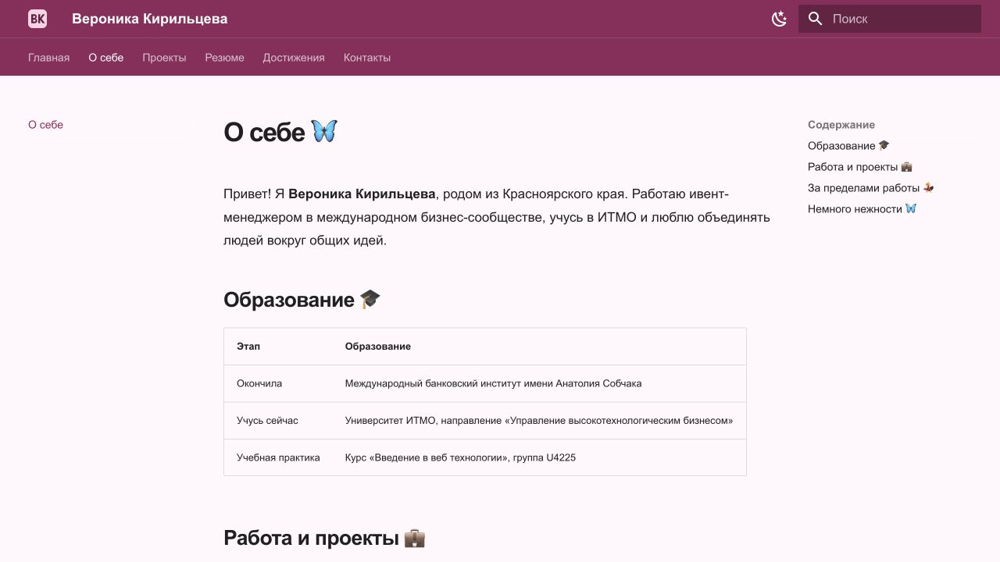
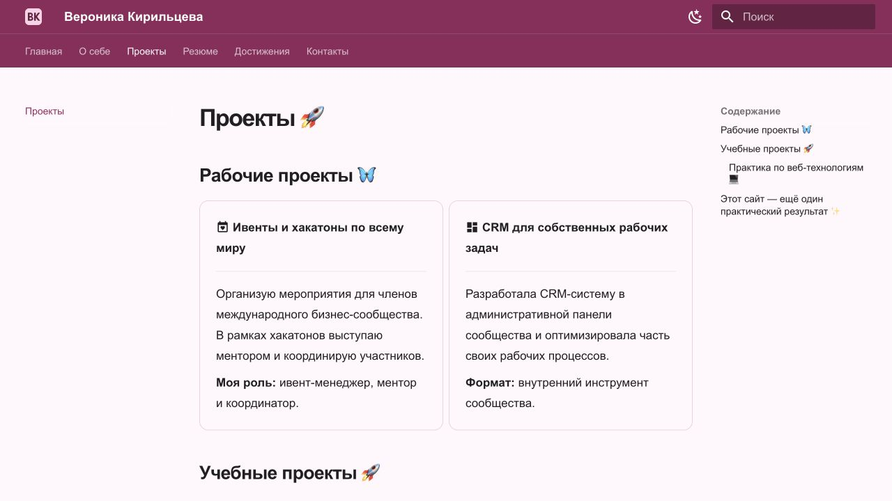
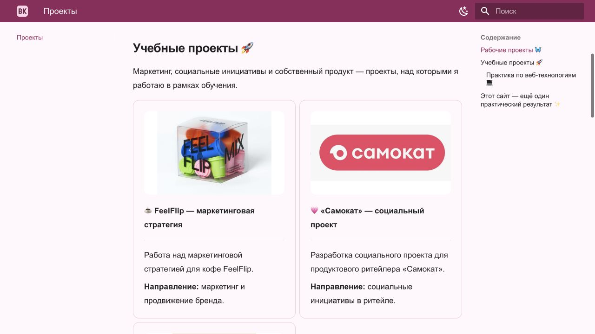
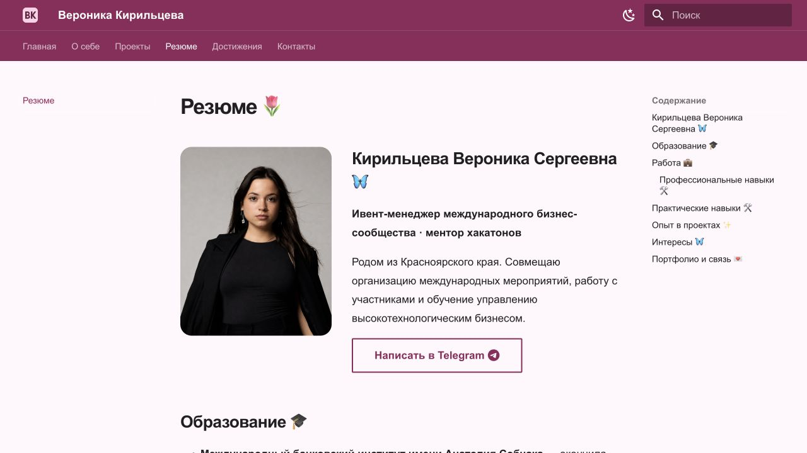
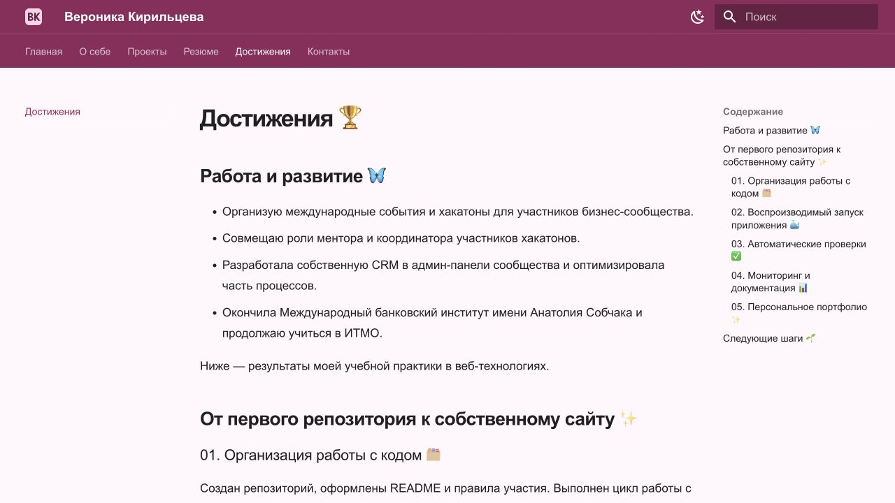
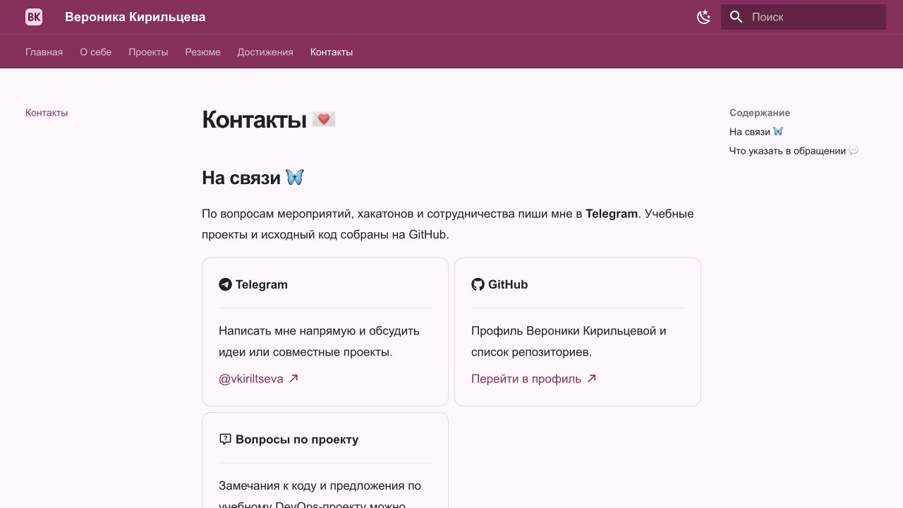

University: [ITMO University](https://itmo.ru/ru/)\
Faculty: [FICT](https://fict.itmo.ru)\
Course: Введение в веб технологии\
Year: 2025/2026\
Group: U4225\
Author: Kiriltseva Veronika Sergeevna\
Date of create: 06.09.2026\
Date of finished: — (будет указана после защиты)

# Курсовая работа

## Создание персонального сайта с использованием MkDocs

**Автор:** Кирильцева Вероника Сергеевна.

**Сайт:** [Открыть персональное портфолио](https://89620761583veronika-png.github.io/2025_2026-introduction-in-web-tech-u4225-kiriltseva_v_s/).

## Введение

Персональный сайт позволяет представить автора, собрать ссылки на проекты и описать практические навыки. Для небольшого портфолио удобно использовать генератор статических сайтов: содержимое хранится в текстовых файлах, а HTML-страницы создаются автоматически.

В работе разработано персональное учебное портфолио на MkDocs с темой Material. Сайт объединяет сведения об образовании, три учебных проекта, резюме, достижения и контакты.

**Цель:** освоить создание и настройку статического сайта с помощью MkDocs и Markdown.

**Задачи:** подготовить окружение; настроить конфигурацию и навигацию; написать содержимое страниц; добавить логотип, поиск и оформление; проверить работу сайта и собрать файлы для размещения на хостинге.

## 1. Используемые технологии

**Markdown** — текстовый язык разметки. Заголовки, списки, ссылки, изображения, цитаты и таблицы описываются простым синтаксисом. Markdown-файлы можно редактировать в обычном текстовом редакторе и хранить в Git.

**MkDocs** преобразует Markdown и настройки из `mkdocs.yml` в статические HTML-страницы. Команда `serve` запускает сервер предварительного просмотра, а `build` создаёт результат в папке `site/`.

**Material for MkDocs** предоставляет готовый интерфейс: адаптивную навигацию, поиск, переключение цветовой схемы и набор компонентов для оформления содержимого.

Сайт не требует собственной базы данных или серверного приложения. Для просмотра собранного результата достаточно HTTP-сервера. Поиск работает в браузере по заранее сформированному индексу.

## 2. Подготовка и установка

Работа выполнена на macOS. Python уже был установлен; использована версия **3.9.6**. Чтобы отделить зависимости проекта от системных библиотек, создано виртуальное окружение:

```sh
mkdir my-personal-site
python3 -m venv my-personal-site/.venv
source my-personal-site/.venv/bin/activate
python -m pip install 'mkdocs>=1.6,<2' 'mkdocs-material>=9.6,<10'
mkdocs new my-personal-site
cd my-personal-site
mkdocs --version
```

Установлены **MkDocs 1.6.1** и **Material 9.7.7**. Основные версии закреплены в `requirements.txt`, полное окружение — в `requirements-lock.txt`. Для повторной установки достаточно `python -m pip install -r requirements.txt`.

После инициализации MkDocs создал файл конфигурации и начальную страницу. Структура расширена следующим образом:

```text
my-personal-site/
├── mkdocs.yml
├── requirements.txt
├── requirements-lock.txt
├── README.md
├── docs/
│   ├── index.md
│   ├── about.md
│   ├── projects.md
│   ├── resume.md
│   ├── achievements.md
│   ├── contacts.md
│   ├── images/logo.svg
│   └── stylesheets/extra.css
├── report/
│   ├── coursework.md
│   └── verification.txt
└── site/
```

## 3. Конфигурация и навигация

В `mkdocs.yml` заданы название сайта, описание и автор. В параметре `site_url` указан реальный адрес сайта на GitHub Pages.

Тема подключена через `theme.name: material`, язык интерфейса — `ru`. Активированы вкладки навигации, разделы, кнопка перехода к началу, переходы между соседними страницами, выделение совпадений поиска, ссылка на поисковый запрос и копирование кода.

```yaml
nav:
  - Главная: index.md
  - О себе: about.md
  - Проекты: projects.md
  - Резюме: resume.md
  - Достижения: achievements.md
  - Контакты: contacts.md
```

Явное описание `nav` задаёт порядок страниц независимо от имён файлов. Внутренние ссылки в Markdown указывают на исходные `.md`-файлы; MkDocs преобразует их в адреса страниц.

## 4. Создание содержимого

| Страница | Содержание и элементы разметки |
| --- | --- |
| Главная | Приветствие, краткое описание, логотип, заголовки трёх уровней, маркированный и нумерованный списки, цитата, ссылки |
| О себе | Образование, учебные интересы, таблицы навыков и сведений об обучении |
| Проекты | Три карточки с задачами, технологиями, результатами и ссылками; пример YAML |
| Резюме | Образование, практические навыки и таблица опыта |
| Достижения | Выполненные учебные задачи и следующие шаги |
| Контакты | GitHub, ссылка на Issues и рекомендации по описанию вопроса |

Карточки оформлены контейнером `grid cards` с атрибутом `markdown`, поэтому содержимое внутри записано в Markdown. Для обработки такого сочетания включено расширение `md_in_html`.

Примеры применённого синтаксиса:

```markdown
## Заголовок раздела

- Пункт списка

1. Первый шаг
2. Второй шаг

[Проекты](projects.md)


> Хорошая документация помогает вернуться к результату.
```

Сведения об авторе и проектах взяты из имеющихся учебных отчётов. 10.09.2026 автор дополнила сведения: образование, работа ивент-менеджером, менторство, собственная CRM и личные интересы. Добавлены предоставленные автором фотографии выдр и эмоджи бабочки.

## 5. Поиск, логотип и оформление

В папке `docs/images/` создан SVG-логотип с монограммой «ВК». Он используется на главной странице, в шапке и как favicon. Изображение хранится вместе с проектом и не зависит от внешнего сервиса.

Поиск настроен явно:

```yaml
plugins:
  - search:
      lang:
        - ru
        - en
```

Во время сборки создаётся `site/search/search_index.json`. Русский и английский языки позволяют искать как русскоязычное описание работ, так и названия технологий.

Выбраны две палитры: светлая и тёмная. Основной цвет — насыщенный розовый, акцент главного блока — светло-розовый. Стили находятся в `docs/stylesheets/extra.css`: настроены размеры текста, отступы, карточки, кнопки и мобильный вариант первого экрана. Используются системные шрифты без запросов к Google Fonts.

Футер содержит имя автора, год, ссылку на GitHub и указание используемой темы. Интерфейс Material сохраняет поиск и навигацию на узком экране, заменяя вкладки компактным меню.

## 6. Тестирование и сборка

Локальный сервер запущен командой:

```sh
mkdocs serve --dev-addr 127.0.0.1:8001
```

Статическая сборка выполнена в строгом режиме:

```sh
mkdocs build --strict
```

| Проверка | Результат |
| --- | --- |
| Строгая сборка MkDocs | Успешно, код завершения 0 |
| Шесть страниц по HTTP | Каждая вернула 200 OK |
| Внутренние ссылки, ресурсы и якоря | Проверено 243 ссылки, ошибок не найдено |
| Поисковый индекс | Создан; содержит страницы и русский текст |
| Поиск в браузере | Запрос «мониторин» показал 4 совпадения |
| Переход с главной к проектам | Открыта страница «Проекты» |
| Переключатель палитры | Подтверждено переключение в тёмную тему |
| Мобильная главная, 390 × 844 | Текст и кнопки помещаются, кнопки расположены вертикально |

При проверке внешних ссылок установлено, что материалы лабораторной №3 ещё не опубликованы. Ссылки с ответом 404 удалены из сайта; указано, что материалы хранятся локально. Остальные 8 внешних адресов сайта вернули HTTP 200.

Текстовый протокол сохранён в [verification.txt](verification.txt). Проверка мобильного вида относится к главной странице и не заявляется как исчерпывающий аудит всех устройств.

Material выводит информационное предупреждение о будущем MkDocs 2.0. В данном проекте зафиксирован MkDocs 1.6.1; сообщение не является ошибкой сборки проекта.

В папке `site/` созданы `index.html`, вложенные страницы, CSS, JavaScript, логотип и индекс поиска. Для просмотра этой папки без MkDocs можно выполнить `python -m http.server 8002 --directory site` и открыть локальный адрес в браузере.

## 7. Публикация

Сайт размещён на **GitHub Pages**: [открыть портфолио](https://89620761583veronika-png.github.io/2025_2026-introduction-in-web-tech-u4225-kiriltseva_v_s/). Он доступен по HTTPS без запуска локального сервера.

Публикация выполнена из корня учебного репозитория командой:

```sh
mkdocs gh-deploy --strict -f coursework/mkdocs.yml
```

MkDocs собрал статические файлы и отправил их в ветку `gh-pages`. В Settings → Pages источник публикации — `Deploy from a branch`, ветка `gh-pages`, папка `/ (root)`. Адрес публикации записан в `site_url`. После изменений исходников публикацию необходимо повторить.

## 8. Скриншоты готового сайта

Скриншоты показывают опубликованную версию сайта: оформление, навигацию, изображения и содержимое шести страниц.

### 1. Главная страница


Розовая палитра, портрет в рамке, приветствие и переходы к разделам.

### 2. О себе



Начало страницы «О себе»: рассказ об авторе и таблица образования.

### 3. Проекты



Рабочие проекты и начало учебного раздела.



Дополнительный снимок: оформление учебных карточек FeelFlip и «Самокат».

### 4. Резюме



Начало резюме: фотография автора, профессиональная роль и ссылка на Telegram.

### 5. Достижения



Результаты профессиональной и учебной деятельности.

### 6. Контакты



Ссылки на Telegram, GitHub и обсуждение задач.

## Заключение

Создано учебное портфолио на MkDocs Material с шестью страницами. Реализованы навигация, русскоязычный поиск, две палитры, логотип и футер. Markdown использован для заголовков, списков, ссылок, изображений, цитаты, таблиц и блоков кода. Статическая сборка и проверки локальных ссылок завершились успешно.

В ходе работы применены настройка Python-окружения, конфигурация YAML, структурирование текста в Markdown и проверка статического сайта. Результат можно расширять редактированием Markdown-файлов без изменения программной основы.

## Вопросы для защиты

1. **Что делает MkDocs?** Собирает статические HTML-страницы из Markdown и конфигурации.
2. **Чем `serve` отличается от `build`?** `serve` запускает локальный просмотр с обновлением; `build` сохраняет готовые файлы в `site/`.
3. **Для чего нужен `mkdocs.yml`?** Для метаданных, темы, навигации, плагинов и расширений.
4. **Как добавить страницу?** Создать файл в `docs/`, добавить его в `nav` и пересобрать сайт.
5. **Как работает поиск?** Использует созданный при сборке индекс и выполняется в браузере.
6. **Зачем виртуальное окружение?** Для изоляции зависимостей проекта.
7. **Зачем строгий режим?** Чтобы завершать сборку ошибкой при предупреждениях MkDocs.
8. **Что загружается на статический хостинг?** Содержимое `site/`, а не виртуальное окружение Python.

## Источники

- [MkDocs: конфигурация](https://www.mkdocs.org/user-guide/configuration/).
- [MkDocs: публикация](https://www.mkdocs.org/user-guide/deploying-your-docs/).
- [Material: настройка поиска](https://squidfunk.github.io/mkdocs-material/setup/setting-up-site-search/).
- [Material for MkDocs](https://squidfunk.github.io/mkdocs-material/).
- [Markdown Guide](https://www.markdownguide.org/).

Дата обращения: 06.09.2026.
