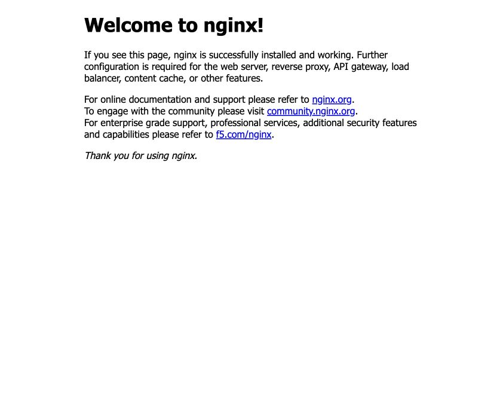

University: [ITMO University](https://itmo.ru/ru/)\
Faculty: [FICT](https://fict.itmo.ru)\
Course: [Введение в веб технологии](https://itmo-ict-faculty.github.io/introduction-in-web-tech/)\
Year: 2025/2026\
Group: U4225\
Author: Kiriltseva Veronika Sergeevna\
Lab: Lab1\
Date of create: 05.09.2026\
Date of finished: — (будет указана после защиты)

# Лабораторная работа №1. Основы работы с Docker

## Цель работы

Научиться работать с Docker: проверять установку, загружать образы, создавать и запускать контейнеры, управлять их жизненным циклом, сохранять данные в томах и собирать собственный образ по Dockerfile.

## Окружение

Работа выполнена на macOS с процессором Apple Silicon (arm64). Docker Desktop уже был установлен; повторная установка не потребовалась. При первоначальной проверке команда `docker` отсутствовала в PATH, а движок Docker не был запущен.

После запуска Docker Desktop получено:

| Компонент | Фактическая версия |
| --- | --- |
| Docker Desktop | 4.82.0 |
| Docker CLI и Engine | 29.6.1 |
| Архитектура клиента | darwin/arm64 |
| Архитектура движка | linux/arm64 |
| Python внутри собственного образа | 3.9.25 |
| Flask / Werkzeug | 2.0.1 / 2.0.3 |

Linux-контейнеры на Mac работают внутри виртуальной машины Docker Desktop. Ранее существовавшие контейнеры и тома PostgreSQL к лабораторной не относятся и не изменялись.

## 1. Проверка Docker

В `~/.zshrc` добавлен путь к установленному клиенту:

```sh
export PATH="/Applications/Docker.app/Contents/Resources/bin:$PATH"
```

Для уже открытого терминала нужно выполнить `source ~/.zshrc`; новые интерактивные сеансы zsh читают настройку автоматически. Работа команды дополнительно проверена в новом сеансе zsh.

Выполнены команды:

```sh
docker --version
docker version
docker run --name lab1-hello hello-world
docker images
docker ps
docker ps -a
```

Получен ответ `Docker version 29.6.1, build 8900f1d`. Тестовый образ автоматически скачался из Docker Hub, контейнер вывел `Hello from Docker!` и завершился с кодом 0. Поэтому он отображается в `docker ps -a`, но не в списке запущенных контейнеров `docker ps`.

Полный вывод: [01-install.txt](logs/01-install.txt).

## 2. Работа с Ubuntu

Загружен образ и запущена интерактивная оболочка:

```sh
docker pull ubuntu:latest
docker run -it --name lab1-ubuntu ubuntu bash
```

Внутри контейнера выполнено:

```sh
apt update && apt install -y curl
curl --version
exit
```

Установлен `curl 8.18.0` для `aarch64-unknown-linux-gnu`. `-i` сохраняет открытым стандартный ввод, `-t` выделяет псевдотерминал. `exit` завершил основной процесс bash, после чего контейнер остановился с кодом 0.

Установленный пакет находится в записываемом слое именно этого контейнера. Исходный образ Ubuntu при этом не изменился; новый контейнер из него не наследует эту установку curl.

Доказательства: [скачивание Ubuntu](logs/02-ubuntu-pull.txt), [запись интерактивной сессии](logs/02-ubuntu-session.txt). Сессия извлечена командой `docker logs lab1-ubuntu`, управляющие ANSI-последовательности удалены для читаемости.

## 3. Запуск веб-сервера nginx

```sh
docker run -d -p 8080:80 --name web-server nginx:alpine
curl -fsS http://localhost:8080
docker logs web-server
docker exec -it web-server sh
```

Внутри оболочки выполнены `nginx -v`, `pwd`, `exit`. Получены версия `nginx/1.31.5` и рабочая директория `/`. Завершение дополнительной оболочки `docker exec` не остановило сервер, поскольку основной процесс nginx продолжил работать.

`-d` запускает контейнер в фоне. Публикация `8080:80` связывает порт 8080 компьютера с портом 80 контейнера. В браузере по адресу `http://localhost:8080` открылась стартовая страница, в логах зафиксирован HTTP-ответ 200.



Рисунок 1 — фактический скриншот страницы nginx во встроенном браузере.

Вывод: [запуск nginx](logs/03-nginx.txt), [ответ сервера и логи](logs/03-nginx-check.txt).

## 4. Управление контейнерами и образами

```sh
docker ps
docker ps -a
docker stop web-server
docker ps -a --filter name=web-server
docker start web-server
curl -fsS http://localhost:8080
docker stop web-server
docker rm web-server
docker rmi nginx:alpine
```

После первой остановки статус изменился на `Exited (0)`. После `docker start` сервер снова вернул стартовую страницу. Затем контейнер повторно остановлен и удалён, образ `nginx:alpine` также удалён.

В последовательность из задания добавлена повторная остановка перед `docker rm`: без неё обычное удаление работающего контейнера завершилось бы ошибкой. `docker start` запускает существующий контейнер, а `docker run` создаёт новый.

Подтверждение всех операций: [04-lifecycle.txt](logs/04-lifecycle.txt). После удаления nginx адрес `localhost:8080` больше не обслуживается этим контейнером.

## 5. Работа с томами

```sh
docker volume create my-volume
docker run -it --name volume-test -d -v my-volume:/data ubuntu bash
docker exec -it volume-test bash
```

Внутри дополнительной оболочки создан и прочитан файл:

```sh
echo "Hello from volume" > /data/test.txt
cat /data/test.txt
exit
```

Далее на компьютере выполнено:

```sh
docker exec volume-test cat /data/test.txt
docker stop volume-test
docker rm volume-test
docker run -it --name volume-test-2 -d -v my-volume:/data ubuntu bash
docker exec volume-test-2 cat /data/test.txt
docker volume inspect my-volume
docker stop volume-test-2
```

До удаления первого контейнера и после создания второго получен одинаковый текст:

```text
Hello from volume
```

Идентификатор первого контейнера — `d34584caf922`, второго — `761f953db30f`. Таким образом, файл прочитан из нового контейнера, подключённого к тому же именованному тому. Том существует независимо от записываемого слоя контейнера и не удаляется обычной командой `docker rm`.

`docker volume inspect` показал драйвер `local` и точку монтирования `/var/lib/docker/volumes/my-volume/_data` внутри Linux-машины Docker Desktop. Это не путь в файловой системе macOS.

Новый контейнер остановлен, том с файлом сохранён для демонстрации. У `volume-test-2` зафиксирован код завершения 137 после `docker stop`: основной процесс bash не завершился за отведённое время и был принудительно остановлен. На результат проверки сохранности файла это не повлияло: чтение успешно выполнено до остановки.

Вывод: [создание тома](logs/05-volume-create.txt), [проверка сохранности](logs/05-volume-persistence.txt).

## 6. Задание со звёздочкой

### Файлы приложения

Созданы [app.py](app.py) и [requirements.txt](requirements.txt) с содержимым из задания. Маршрут `/` возвращает `Hello from Docker!`, приложение слушает `0.0.0.0:5000`.

В `requirements.txt` сохранена заданная строка:

```text
Flask==2.0.1
```

Дополнительно создан [constraints.txt](constraints.txt):

```text
Werkzeug==2.0.3
```

Ограничение фиксирует совместимую с Flask 2.0.1 ветку Werkzeug 2.0. У старого Flask нет достаточного верхнего ограничения этой зависимости, поэтому установка одной строки из задания может выбрать несовместимый Werkzeug. В данной работе сразу использовано ограничение; неудачная сборка без него не выполнялась. Успешные импорт Flask, HTTP-запрос и `pip check` подтверждают работоспособность выбранной комбинации.

### Dockerfile

Создан [Dockerfile](Dockerfile):

```dockerfile
FROM python:3.9-slim

WORKDIR /app

RUN apt-get update \
    && apt-get install -y --no-install-recommends curl vim \
    && rm -rf /var/lib/apt/lists/*

COPY requirements.txt constraints.txt ./
RUN pip install --no-cache-dir -r requirements.txt -c constraints.txt

COPY app.py ./

RUN useradd --uid 1000 --create-home appuser
USER appuser

EXPOSE 5000
ENV FLASK_ENV=production

CMD ["python", "app.py"]
```

| Требование | Реализация / результат проверки |
| --- | --- |
| Базовый образ `python:3.9-slim` | Использован в `FROM`, в контейнере Python 3.9.25 |
| Рабочая директория `/app` | `WORKDIR /app`, команда `pwd` вернула `/app` |
| Пакеты curl и vim | Установлены через apt, проверены версии 8.14.1 и 9.1 |
| Python-пакеты из requirements.txt | `pip install -r requirements.txt -c constraints.txt` |
| Копирование app.py | `COPY app.py ./` |
| Пользователь appuser с UID 1000 | `useradd --uid 1000 --create-home appuser` |
| Запуск от appuser | `USER appuser`; `id` вернул UID и GID 1000 |
| Порт 5000 | `EXPOSE 5000`, приложение слушает порт 5000 |
| Переменная окружения | `printenv FLASK_ENV` вернул `production` |
| Команда запуска | `CMD ["python", "app.py"]`, подтверждена `docker inspect` |

`RUN` выполняет команды при сборке, а `CMD` задаёт команду запуска контейнера. `EXPOSE` описывает порт; публикация на компьютере задаётся отдельно флагом `-p`. См. [справочник Dockerfile](https://docs.docker.com/reference/dockerfile/).

Зависимости копируются раньше приложения, чтобы изменение только `app.py` не требовало повторной установки пакетов. [.dockerignore](.dockerignore) исключает отчёт, логи и скриншоты из контекста сборки.

### Сборка и запуск

```sh
docker build -t my-flask-app .
```

Образ успешно собран; его идентификатор начинается с `07da595e4740`. Для сохранения подробного протокола сборки использован дополнительный флаг `--progress=plain`. [Лог сборки](logs/06-flask-build.txt).

Первоначально выполнена команда из задания:

```sh
docker run -d -p 5000:5000 --name flask-container my-flask-app
```

Docker сообщил `bind: address already in use`. Команда `lsof -nP -iTCP:5000 -sTCP:LISTEN` показала системный процесс `ControlCe` (Control Center, PID 459), занимающий порт 5000. Не запустившийся контейнер удалён, опубликован свободный порт 5001:

```sh
docker rm flask-container
docker run -d -p 5001:5000 --name flask-container my-flask-app
curl -fsS http://localhost:5001
```

Первый запрос сразу после старта получил сброс соединения; повторный запрос после запуска процесса Flask завершился успешно. Итоговый ответ:

```text
HTTP/1.0 200 OK
Content-Type: text/html; charset=utf-8
Content-Length: 18

Hello from Docker!
```

Изменён только порт компьютера. Порт контейнера, `app.py` и Dockerfile соответствуют заданию. Доступ к внутреннему порту также проверен:

```sh
docker exec flask-container curl -fsS http://localhost:5000
```

Ответ — `Hello from Docker!`.


Рисунок 2 — фактический скриншот работающего приложения в браузере.

Проверки:

```sh
docker exec flask-container id
# uid=1000(appuser) gid=1000(appuser) groups=1000(appuser)
docker exec flask-container pwd
# /app
docker exec flask-container printenv FLASK_ENV
# production
docker exec flask-container pip check
# No broken requirements found.
```

`FLASK_ENV=production` задан по условию. При этом `app.run()` запускает встроенный сервер разработки, что прямо указано в логах; эта переменная не превращает его в промышленный WSGI-сервер.

Доказательства: [ошибка порта 5000](logs/07-flask-check.txt), [процесс, занимающий порт](logs/07-port-conflict.txt), [запуск на 5001](logs/07-flask-check-5001.txt), [успешные проверки](logs/07-flask-verified.txt), [итоговое состояние и HTTP-ответ](logs/08-final-state.txt).

## Результаты и вывод

Выполнены обычная часть и задание со звёздочкой. Проверена работа Docker Desktop, загружены готовые образы, установлен пакет в интерактивном контейнере Ubuntu, запущен nginx, выполнены остановка, повторный запуск и удаление контейнера и образа. Сохранность данных в именованном томе подтверждена чтением файла из другого контейнера.

Создан и проверен собственный образ Flask: приложение отвечает на HTTP-запросы и работает от непривилегированного пользователя с UID 1000. Освоены различия между образом, контейнером и томом, между сборкой и запуском, а также между портом компьютера и портом контейнера.

На момент завершения практической части `flask-container` оставлен запущенным на `http://localhost:5001`. `lab1-hello`, `lab1-ubuntu` и `volume-test-2` остановлены; `my-volume` сохранён. nginx и его контейнер удалены согласно заданию.

## Вопросы для защиты

1. **Чем образ отличается от контейнера?** Образ — шаблон файловой системы и настроек; контейнер — его экземпляр с собственным записываемым слоем и состоянием процессов.
2. **Почему контейнер hello-world сразу завершился?** Его основной процесс вывел сообщение и завершился. Контейнер работает, пока работает основной процесс.
3. **Что делают `-it`, `-d`, `-p` и `--name`?** Подключают интерактивный терминал, запускают в фоне, публикуют порт и задают имя соответственно.
4. **В чём отличие `run`, `start`, `exec`?** Создать и запустить новый контейнер; запустить остановленный; выполнить дополнительную команду в работающем.
5. **Почему curl, установленный в Ubuntu вручную, отсутствует в новом контейнере?** Изменён слой конкретного контейнера, а не исходный образ.
6. **Почему файл сохранился после `docker rm`?** Файл записан в именованный том, который существует отдельно от контейнера.
7. **Чем `EXPOSE 5000` отличается от `-p 5001:5000`?** Первая инструкция описывает порт образа, второй параметр публикует внутренний порт 5000 через порт 5001 компьютера.
8. **Зачем слушать `0.0.0.0`?** Чтобы принимать соединения на сетевых интерфейсах контейнера, а не только на его loopback-интерфейсе.
9. **Зачем `USER appuser`?** Чтобы основной процесс приложения работал без прав root.
10. **Как повторно показать файл в томе?** Выполнить `docker start volume-test-2`, затем `docker exec volume-test-2 cat /data/test.txt`.

## Источники

- [Правила оформления отчётов курса](https://itmo-ict-faculty.github.io/introduction-in-web-tech/education/labs2025-2026/reportdesign/).
- [Справочник Dockerfile](https://docs.docker.com/reference/dockerfile/).
- [Документация Flask](https://flask.palletsprojects.com/en/stable/).
- [История изменений Werkzeug](https://werkzeug.palletsprojects.com/en/stable/changes/).
