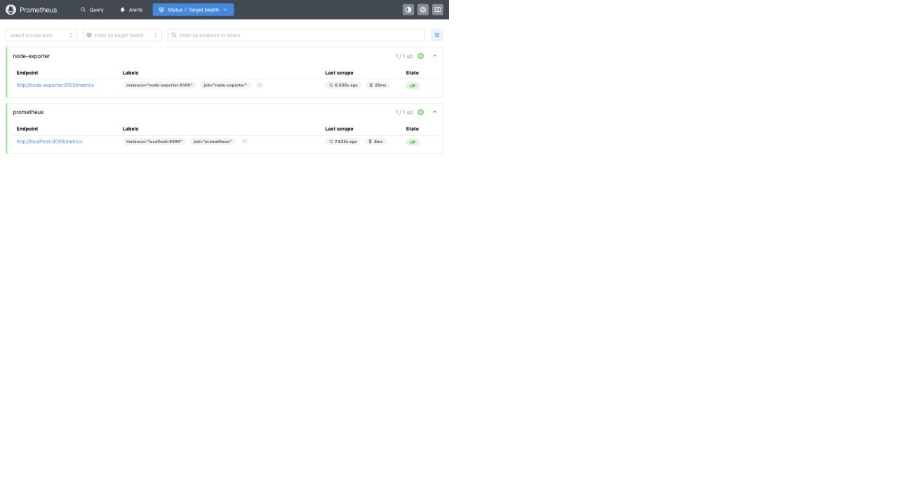
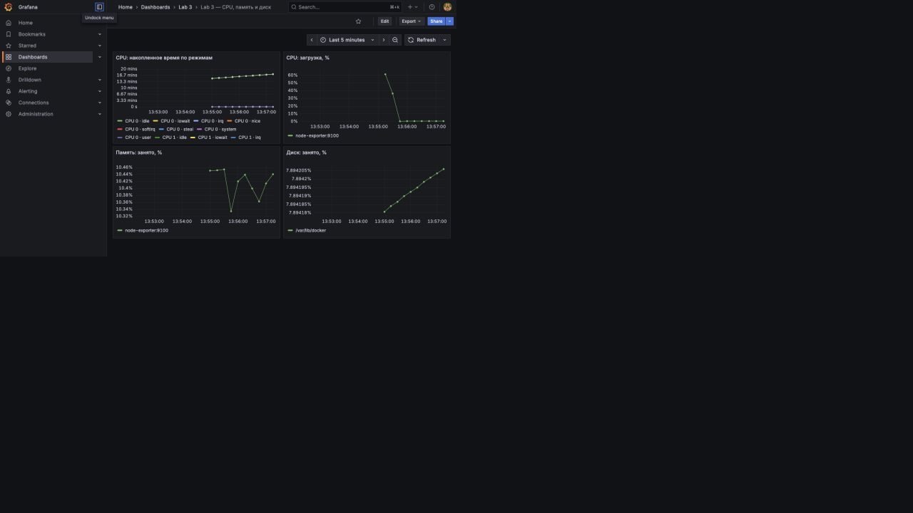
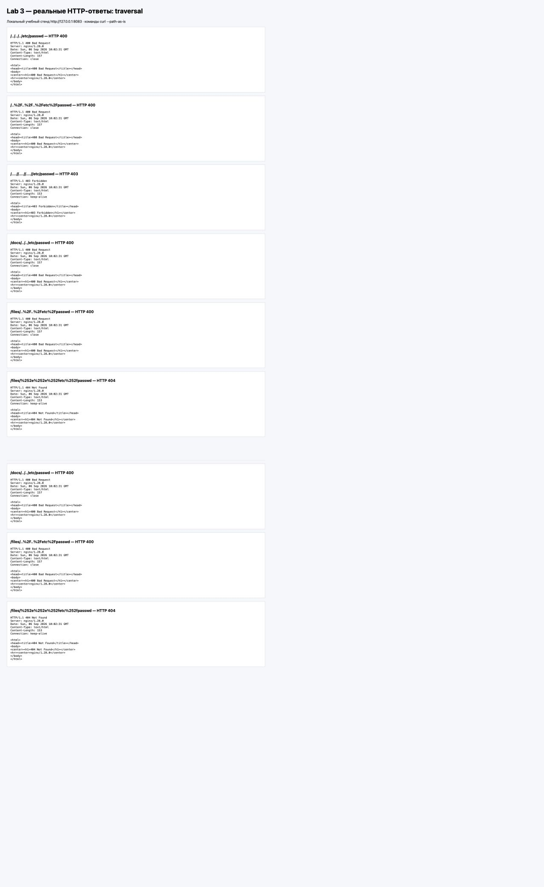
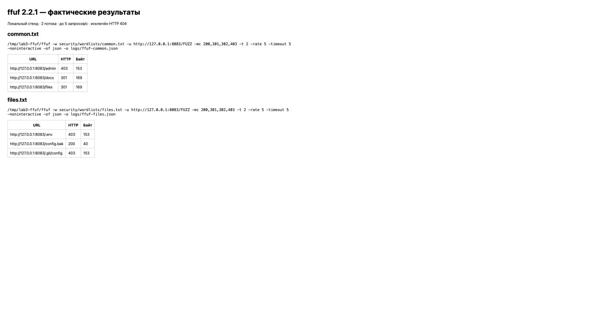
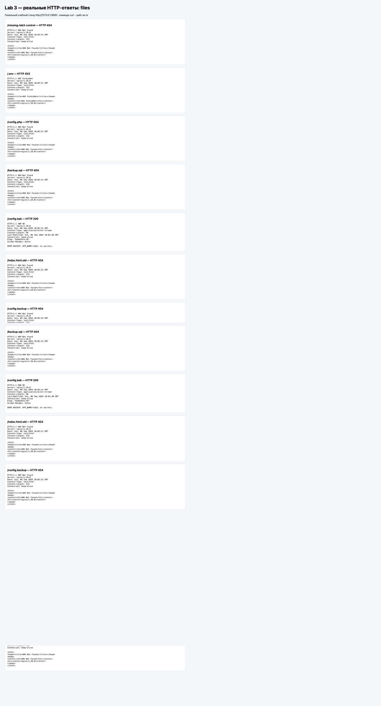
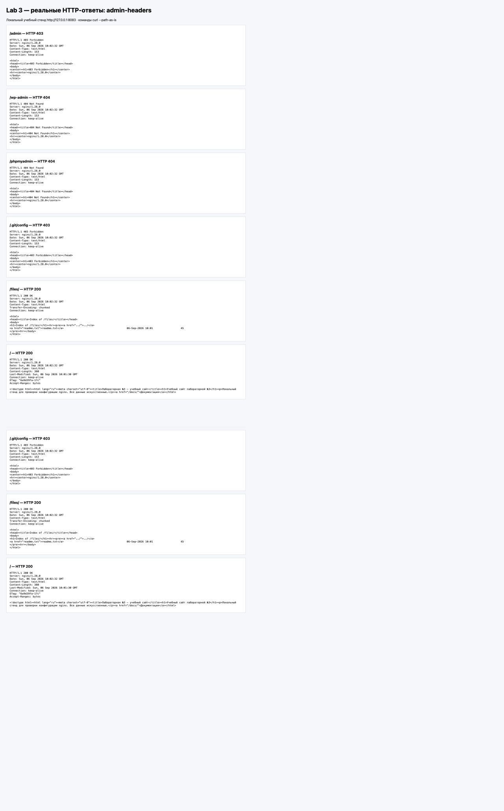

University: [ITMO University](https://itmo.ru/ru/)\
Faculty: [FICT](https://fict.itmo.ru)\
Course: [Введение в веб технологии](https://itmo-ict-faculty.github.io/introduction-in-web-tech/)\
Year: 2025/2026\
Group: U4225\
Author: Kiriltseva Veronika Sergeevna\
Lab: Lab3\
Date of create: 06.09.2026\
Date of finished: — (будет указана после защиты)

# Лабораторная работа №3. Мониторинг и тестирование безопасности веб-сайта

## Цель работы

Настроить локальную систему мониторинга с Prometheus, Node Exporter и Grafana, получить графики CPU, памяти и диска. Изучить проверку Path Traversal, поиск страниц с ffuf и влияние ошибок конфигурации веб-сервера на доступность файлов.

## 1. Окружение и состав работы

Работа выполнена на macOS / Apple Silicon с Docker Desktop и Docker Compose. Созданы и фактически запущены четыре контейнера:

| Сервис | Образ | Адрес на компьютере |
| --- | --- | --- |
| Node Exporter | `prom/node-exporter:v1.9.1` | http://localhost:9100/metrics |
| Prometheus | `prom/prometheus:v3.5.0` | http://localhost:9090 |
| Grafana | `grafana/grafana:12.1.1` | http://localhost:3000 |
| Учебный сайт | `nginx:1.28.0-alpine` | http://127.0.0.1:8083 |

Все порты опубликованы на `127.0.0.1`. Образы зафиксированы по версиям; это версии выполненного опыта, а не утверждение об их актуальности. [Фактический список контейнеров](logs/containers.txt).

Основные файлы: [compose.yaml](compose.yaml), [конфигурация Prometheus](prometheus/prometheus.yml), [источник Grafana](grafana/provisioning/datasources/prometheus.yml), [настройка загрузки дашборда](grafana/provisioning/dashboards/default.yml), [дашборд JSON](grafana/dashboards/system.json), [конфигурация сайта](security/nginx.conf).

**Область измерений:** Linux Node Exporter в Docker Desktop собирает данные Linux-среды Docker. CPU и память не следует считать прямыми метриками macOS. Для диска выбран раздел `/var/lib/docker`; другие Linux-окружения могут использовать другую точку монтирования. Каталоги, предоставленные macOS виртуальной машине, также могут появляться среди файловых систем экспортера.

## 2. Настройка Prometheus и Node Exporter

Создан файл `prometheus/prometheus.yml`:

```yaml
global:
  scrape_interval: 15s
scrape_configs:
  - job_name: prometheus
    static_configs:
      - targets: ['localhost:9090']
  - job_name: node-exporter
    static_configs:
      - targets: ['node-exporter:9100']
```

Prometheus опрашивает себя и Node Exporter каждые 15 секунд. `localhost:9090` внутри Prometheus указывает на сам контейнер. Для другого сервиса используется DNS-имя `node-exporter` общей сети.

В исходной инструкции Node Exporter запускался без подключения к сети `monitoring`. Это мешает разрешению его имени из Prometheus. В Compose все три сервиса мониторинга включены в сеть `monitoring` проекта `lab3` (фактическое имя `lab3_monitoring`). Учебный сайт помещён в отдельную сеть `lab3_security`.

Node Exporter получает `/proc`, `/sys` и корень Linux-среды через монтирования только для чтения. Флаги `--path.procfs`, `--path.sysfs` и `--path.rootfs` указывают соответствующие пути внутри контейнера. Использован `pid: host`. Регулярное выражение исключает служебные точки монтирования; `$$` в Compose передаёт приложению один символ `$`.

Compose автоматически создаёт именованные тома `lab3_prometheus-data` и `lab3_grafana-data`. Prometheus хранит данные в `/prometheus`, срок хранения — `200h`. Конфигурация монтируется отдельно, только для чтения. Ненужные для этой работы старые флаги console templates и HTTP lifecycle не включены.

Запуск из корня учебного репозитория:

```sh
docker compose -f lab3/compose.yaml up -d
docker compose -f lab3/compose.yaml ps
curl http://localhost:9100/metrics
docker compose -f lab3/compose.yaml exec -T prometheus \
  promtool check config /etc/prometheus/prometheus.yml
```

Получен текстовый ответ с системными метриками. `promtool` подтвердил корректность конфигурации. В Prometheus обе цели имеют состояние **UP** без ошибки последнего сбора.

Доказательства: [метрики](logs/node-metrics.txt), [promtool](logs/promtool.txt), [Targets API](logs/prometheus-targets.json).



## 3. Настройка Grafana и визуализация

Вход выполнен с учебными данными `admin` / `admin`. Источник Prometheus и дашборд созданы автоматически через YAML/JSON provisioning. Это воспроизводимый эквивалент ручного добавления через интерфейс. Источник использует адрес `http://prometheus:9090`, тип Prometheus, режим proxy и UID `prometheus`.

Проверка источника через API Grafana вернула `status: OK` и сообщение `Successfully queried the Prometheus API.`. [Ответ проверки](logs/grafana-datasource-health.json).

Дашборд **Lab 3 — CPU, память и диск** сохранён в папке **Lab 3**. Его можно открыть по адресу http://localhost:3000/d/lab3-system. В конфигурации задано обновление раз в 15 секунд и диапазон последних 5 минут.

| Панель | Запрос PromQL | Смысл |
| --- | --- | --- |
| CPU: накопленное время | `node_cpu_seconds_total` | Счётчик секунд по ядрам и режимам; это не процент загрузки |
| CPU: загрузка, % | `100 * (1 - avg by(instance) (rate(node_cpu_seconds_total{mode="idle"}[1m])))` | Доля времени вне idle, усреднённая по ядрам |
| Память: занято, % | `100 * (1 - node_memory_MemAvailable_bytes / node_memory_MemTotal_bytes)` | Доля памяти, недоступной для новых приложений |
| Диск: занято, % | `100 * (1 - node_filesystem_avail_bytes{mountpoint="/var/lib/docker"} / node_filesystem_size_bytes{mountpoint="/var/lib/docker"})` | Доля диска, недоступная обычному пользователю, включая резерв файловой системы |

`rate()` вычисляет скорость изменения счётчика; после запуска для результата нужны несколько измерений. При переносе на другой компьютер точку монтирования диска нужно выбрать из метрик `node_filesystem_size_bytes`.



Все четыре запроса проверены через API Prometheus: 80 временных рядов у исходного CPU-счётчика и по одному у загрузки CPU, памяти и выбранного диска. В ответах есть числовые значения. Выполнена визуальная проверка графиков в браузере. [Сводный лог](logs/verification.txt), [сохранённый дашборд из API](logs/grafana-dashboard.json), [CPU](logs/query-1.json), [загрузка](logs/query-2.json), [память](logs/query-3.json), [диск](logs/query-4.json).

## 4. Выбор сайта и методика проверки безопасности

**URL цели: http://127.0.0.1:8083.** Для опыта создан собственный локальный статический сайт nginx. Это адаптация задания: внешний сайт организации не тестировался. Если преподаватель требует именно внешний ресурс, потребуется отдельная согласованная цель; результаты локального опыта нельзя переносить на неё.

В стенде намеренно оставлены учебные ошибки: открытый просмотр каталога `/files/` и доступная копия `config.bak`. Они содержат только искусственные строки без секретов. Исходники расположены в [security/site](security/site/). Это контролируемая демонстрация влияния конфигурации, а не обнаружение неизвестной уязвимости стороннего сайта.

Использованы curl, Python 3 и ffuf 2.2.1. ffuf получен из [официального выпуска](https://github.com/ffuf/ffuf/releases/tag/v2.2.1), бинарник для macOS arm64 распакован в `/tmp/lab3-ffuf`. Бинарник не включён в репозиторий; после очистки временной папки его потребуется установить заново. При наличии Go возможна установка `go install github.com/ffuf/ffuf/v2@v2.2.1`.

Автоматический поиск ограничен двумя небольшими словарями, двумя потоками и скоростью до 5 запросов/с. DDoS, подбор паролей и изменения данных через найденные пути не выполнялись.

## 5. Проверка Path Traversal

Команды выполнялись с `curl --path-as-is`: без этого curl может нормализовать `../` до отправки. Проверены обычные пути, percent encoding, повторные разделители и двойное кодирование. Скрипт [security-check.py](scripts/security-check.py) сохраняет команду, заголовки и тело каждого ответа.

| Путь | HTTP | Результат |
| --- | --- | --- |
| `/../../../etc/passwd` | 400 | Запрос отклонён |
| `/..%2F..%2F..%2Fetc%2Fpasswd` | 400 | Запрос отклонён |
| `/....//....//....//etc/passwd` | 403 | Доступ запрещён |
| `/docs/../../etc/passwd` | 400 | Запрос отклонён |
| `/files/..%2F..%2Fetc%2Fpasswd` | 400 | Запрос отклонён |
| `/files/%252e%252e%252fetc%252fpasswd` | 404 | Ресурс не найден |

Ни один ответ не содержал файл `/etc/passwd`. Для варианта с четырьмя точками срабатывает правило запрета путей, начинающихся с точки. Двойное кодирование не привело к выходу за корень сайта. Эти шесть проверок не доказывают отсутствие всех возможных уязвимостей.



Скриншоты проверок безопасности сделаны с HTML-представления сохранённых реальных ответов curl; это не снимки терминала. Оригиналы находятся в `logs/security-01.txt` — `logs/security-19.txt`, общий [машиночитаемый журнал](logs/security-results.json) содержит время опыта и все ответы.

## 6. Перебор страниц через ffuf

Созданы два словаря: [common.txt](security/wordlists/common.txt) с 8 путями и [files.txt](security/wordlists/files.txt) с 9 путями. Использованы собственные короткие списки вместо больших стандартных словарей: они покрывают все классы проверок из задания на небольшом локальном сайте.

```sh
cd lab3
ffuf -w security/wordlists/common.txt \
  -u http://127.0.0.1:8083/FUZZ -mc 200,301,302,403 \
  -t 2 -rate 5 -timeout 5 -noninteractive \
  -of json -o logs/ffuf-common.json
```

Второй запуск использует `security/wordlists/files.txt` и сохраняет `logs/ffuf-files.json`. Оба запуска воспроизводит [ffuf-check.sh](scripts/ffuf-check.sh).

Контрольный несуществующий путь `/missing-lab3-control` вернул 404. Фильтр `-mc` оставляет только 200, 301, 302 и 403, исключая эти отрицательные ответы. Фильтрация только по размеру не применялась: ответы 403 и 404 могут иметь одинаковый размер 153 байта, и такой фильтр потерял бы полезные результаты. Редиректы автоматически не обходились; каталог `/files/` затем проверен отдельным запросом.

| Словарь | Найденный путь | HTTP | Интерпретация |
| --- | --- | --- | --- |
| common | `/admin` | 403 | Запрет, заданный конфигурацией |
| common | `/docs` | 301 | Перенаправление к каталогу со слешем |
| common | `/files` | 301 | Перенаправление к каталогу со слешем |
| files | `/.env` | 403 | Общее правило запрета скрытых путей |
| files | `/config.bak` | 200 | Фактически доступная учебная копия |
| files | `/.git/config` | 403 | Общее правило запрета скрытых путей |

403 сам по себе **не доказывает существование файла или админ-панели**: в нашем стенде запрет применяется по шаблону URL ещё до проверки существования ресурса.



Исходные результаты: [common JSON](logs/ffuf-common.json), [files JSON](logs/ffuf-files.json), [лог common](logs/ffuf-common.txt), [лог files](logs/ffuf-files.txt).

## 7. Дополнительные проверки и выводы по безопасности

| Проверка | Наблюдение | Вывод |
| --- | --- | --- |
| `.env`, `.git/config` | 403 | Доступ запрещён; существование не подтверждено |
| `config.php`, `backup.sql` | 404 | По этим адресам не найдены |
| `config.bak` | 200, 40 байт | Доступна искусственная резервная копия |
| `index.html.old`, `config.backup` | 404 | По этим адресам не найдены |
| `/admin` | 403 | Доступ запрещён конфигурацией |
| `/wp-admin`, `/phpmyadmin` | 404 | По этим адресам не найдены |
| `/files/` | 200, `Index of /files/`, ссылка `readme.txt` | Открыт просмотр каталога |
| Заголовок `Server` | `nginx/1.28.0` | Раскрывается продукт и его версия |
| Заголовки главной страницы | Нет CSP и X-Content-Type-Options | Возможность усилить конфигурацию; эксплуатация не доказана |

Тело копии: `DEMO BACKUP: APP_NAME=lab3; no secrets.`. Наличие реальных секретов в резервной копии могло бы привести к их раскрытию. В данном опыте секретов нет.





Рекомендации: хранить резервные копии вне web-root, запрещать выдачу `.bak`, `.old`, `.backup`, выключить `autoindex`, ограничить административные маршруты аутентификацией и доступом по сети. `server_tokens off` уменьшает раскрытие версии, но не устраняет уязвимости; обновления сервера всё равно нужны. Политики CSP и `X-Content-Type-Options: nosniff` подбираются под приложение. Для внешнего размещения нужен HTTPS; локальный HTTP в этом опыте используется сознательно.

В стенде ошибки оставлены для воспроизведения опыта. Общий вывод ограничен проверенными путями: успешный Path Traversal не обнаружен, но избыточная выдача файлов и сведений о сервере подтверждена.

## 8. Повторный запуск и демонстрация

Из корня репозитория:

```sh
docker compose -f lab3/compose.yaml up -d
# После первого запуска дождаться нескольких сборов метрик (~60 секунд).
python3 lab3/scripts/monitoring-check.py
python3 lab3/scripts/security-check.py
FFUF=/tmp/lab3-ffuf/ffuf sh lab3/scripts/ffuf-check.sh
```

Если ffuf установлен в PATH, достаточно `sh lab3/scripts/ffuf-check.sh`. Повторная проверка обновляет журналы; скриншоты отражают опыт 06.09.2026 и автоматически не переснимаются.

На защите открыть Prometheus → Targets, показать обе цели UP; открыть Grafana, источник данных и четыре графика; объяснить формулу CPU и отличие счётчика от загрузки; показать результаты ffuf и различие 403/404/200.

Остановка с сохранением данных:

```sh
docker compose -f lab3/compose.yaml down
```

Именованные тома сохраняются. `down -v` удаляет данные, поэтому для обычной остановки не используется.

## Вывод

Локальная система мониторинга запущена и проверена: Prometheus собирает метрики двух целей, Grafana получает данные и отображает CPU, память и диск. Исправлена сетевая связность Node Exporter. На собственном локальном сайте выполнены шесть попыток Path Traversal, два запуска ffuf и дополнительные проверки файлов, панелей и заголовков. Подтверждены учебные ошибки выдачи резервной копии, просмотра каталога и раскрытия версии сервера. Результаты подкреплены журналами и скриншотами; внешний сайт не исследовался.

## Вопросы для защиты

1. **Как Prometheus получает метрики?** Сам периодически отправляет HTTP-запросы к `/metrics` (pull-модель).
2. **Зачем Node Exporter?** Он преобразует системные данные Linux в метрики формата Prometheus.
3. **Почему Grafana использует `prometheus:9090`?** Это адрес сервиса в общей Docker-сети; `localhost` внутри Grafana указывал бы на саму Grafana.
4. **Что сохраняют тома?** Временные ряды Prometheus и базу настроек Grafana независимо от пересоздания контейнеров.
5. **Зачем `rate()`?** Перевести накопленный CPU-счётчик в скорость изменения и затем вычислить долю занятого времени.
6. **Что такое Path Traversal?** Попытка выйти за разрешённый каталог через манипуляции путём и кодировками.
7. **Что делает ffuf?** Подставляет строки словаря вместо `FUZZ` и отбирает ответы по заданным критериям.
8. **Почему 403 не означает найденную панель?** Сервер может запретить любой адрес по шаблону, даже если ресурса нет.
9. **Почему нельзя утверждать, что сайт полностью безопасен?** Проверен ограниченный набор путей и вариантов, а не все возможные механизмы приложения.

## Источники

- [Правила оформления отчётов ИТМО](https://itmo-ict-faculty.github.io/introduction-in-web-tech/education/labs2025-2026/reportdesign/).
- [Node Exporter: запуск в Docker](https://github.com/prometheus/node_exporter/blob/master/README.md).
- [Grafana: provisioning](https://grafana.com/docs/grafana/latest/administration/provisioning/).
- [ffuf: официальный репозиторий](https://github.com/ffuf/ffuf).
